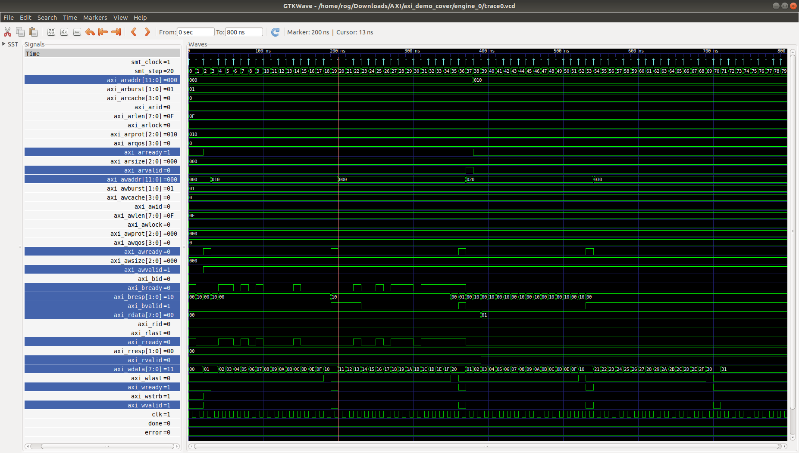

# AXI
A simple AXI demo example

This is AXI memory controller with _WDATA_ and _AWADDR_ re-transmission feature in the case of NACK (bad BRESP from AXI slave)

TODO :
1. Solve [Xilinx AXI protocol checker issue](https://github.com/alexforencich/verilog-axi/issues/8)
2. Replace [AXI slave code](https://github.com/alexforencich/verilog-axi/blob/master/rtl/axi_ram.v) with my own AXI slave code
3. Formally verify the entire AXI protocol transactions

Credit : @alexforencich 
